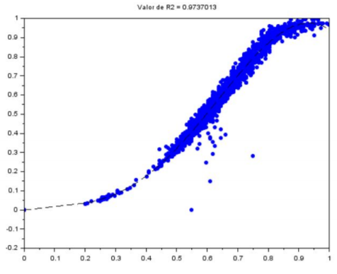

# Inteligencia_Computacional

Estes projetos foram desenvolvidos ao longo da disciplina de Inteligência Computacional, ministrada na Universidade Federal do Ceará. 

### Lógica Fuzzy
Este projeto utiliza Lógica Fuzzy (inferência de Mamdani) para calcular a pressão do freio utilizando três valores de entrada: pressão no pedal, velocidade da roda e velocidade do carro.

### Regressão Polinomial

Usando o conjunto de dados do aerogerador - variável de entrada (primeira coluna): velocidade do vento; variável de saída (segunda coluna): potência gerada é determinado os modelos de regressão polinomial (graus: 1 até 5) com parâmetros estimados pelo método dos mínimos quadrados.

  
  

### Regressão Múltipla

Dada a base de dados:

Na qual a primeira e segunda colunas são as variáveis regressoras (x1 e x2) e a terceira coluna é a variável dependente (y), é determinado o modelo de regressão múltipla (plano) com parâmetros estimados pelo método dos mínimos quadrados. Avaliando a qualidade do modelo pela métrica R2.

### Neurônio Perceptron
O Perceptron é uma rede que recebe vários valores de entrada e apenas uma única saída. É uma rede bem simples, com apenas uma camada, sendo muito utilizada para demonstrar como funcionam neurônios simples. Este projeto implementa um neurônio Perceptron com valores de pesos inicialmente aleatórios que resolvem o problema do AND com duas variáveis.

### Rede RBF
A rede RBF é mais complexa, possuindo duas camadas de neurônios, onde os neurônios da primeira camada utilizam funções de ativação não lineares e os neurônios da segunda camada utilizam funções de ativação lineares. Este trabalho implementa uma rede RBF para criar uma curva que se ajusta ao conjunto de dados do aerogerador.

### Rede Neural RLM
A ELM, Máquina de Aprendizado Extremo são redes neurais avançadas que podem ser utilizada para muitos fins, entre eles o de classificação e regressão. Utilizando o conjunto de dados 2-D disponível no arquivo “two_classes.dat” foi plotado o gráfico de dispersão usando cores diferentes para diferenciar entre os dados de uma classe e da outra. Tracando a superfície de decisão obtida com o uso de todas as amostras como treinamento usando a rede neural ELM.  

### Algoritmos genéticos

Um algoritmo genético é uma técnica derivada dos algoritmos evolutivos que é amplamente utilizada na ciência da computação. Ela se inspira na biologia evolutiva para encontrar soluções para alguns problemas, para isso, são utilizadas técnicas de hereditariedade, mutação, recombinação e seleção natural. Em seu funcionamento, esse tipo de algoritmo tenta imitar a evolução dos seres vivos, criando inicialmente uma população de indivíduos aleatórios e depois combinações e mutações entre esses indivíduos, realizando esse processo por várias gerações. 

Este trabalho criou um algoritmo genético para achar o mínimo da função de Rosenbrock f(x, y) = (1 – x) 2 + 100(y – x 2 ) 2 no intervalo x ∊ [-5 5] e y ∊ [-5 5]. Onde cada indivíduo da população é um vetor binário de 20 bits, em que os 10 primeiros representam x e os restantes representam y. 

  
  

